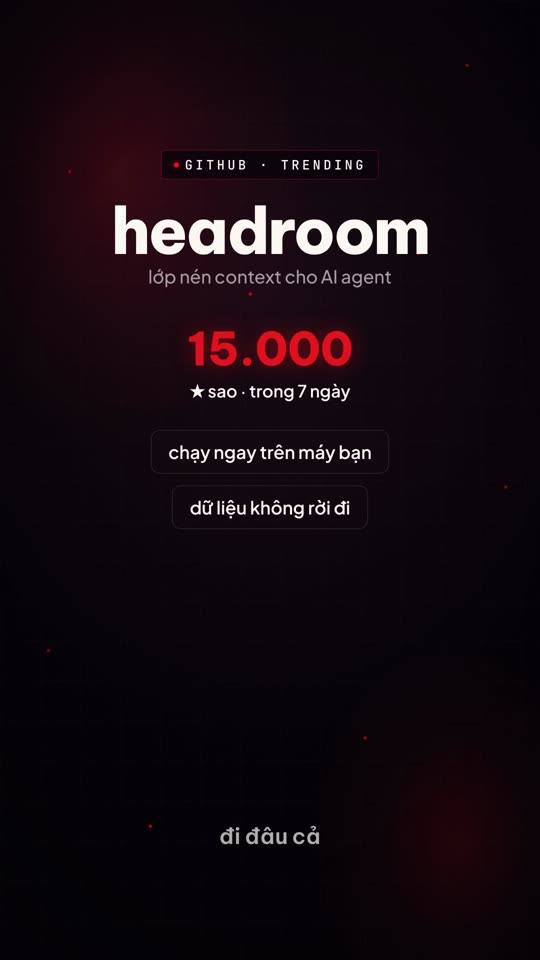

# Daily AI News Shorts

Pipeline để Claude Code tự gen một video AI news short tiếng Việt 1080×1920 mỗi ngày. Đọc nguồn tin, chọn chủ đề, viết script, sinh giọng đọc, dựng motion graphics, render. Không có người can thiệp ở giữa.

Agent đọc [`AGENT-RUNBOOK.md`](AGENT-RUNBOOK.md) rồi chạy tuần tự 11 bước trong đó.

## Demo

Video dưới đây do pipeline tự sinh, không sửa tay. 56 giây, chủ đề chọn từ GitHub trending trong ngày.

[](docs/demo-daily-short.mp4)

## Vấn đề khó nhất: TTS tiếng Việt đọc tên riêng tiếng Anh

Đây là phần đáng đọc nhất trong repo, kể cả khi bạn không dùng pipeline này.

TTS đọc "GitHub" hay "Anthropic" bằng giọng Anh chen vào giữa câu tiếng Việt nghe rất lạc. Cách xử lý là viết phiên âm: "Gít Hấp", "Entropic". Nhưng lúc đó Whisper transcribe lại sẽ nghe ra phiên âm, và caption hiện lên màn hình thành "Gít Hấp" thay vì "GitHub".

Giải bằng ba file:

| File | Nội dung | Dùng cho |
|---|---|---|
| `assets/vo-script.txt` | bản phiên âm | TTS đọc |
| `assets/vo-script-display.txt` | bản tên thật | đối chiếu |
| `assets/replacements.json` | map phiên âm ngược về tên thật | caption |

Sau khi Whisper trả word-timing, `generate-captions.mjs` áp `replacements.json` để map ngược. Giọng đọc đúng, caption hiện đúng.

Bảng phiên âm có sẵn trong runbook: Claude → "Plot", Anthropic → "Entropic", GitHub → "Gít Hấp", LLM → "Eo Eo Em", API → "A Pi I". Tên mới không có trong bảng thì tự phiên âm theo cách đọc.

## Vài thứ khác học được khi build

- **Thời lượng tính được, không đoán.** 180 đến 210 từ, qua `atempo 1.15`, ra 55 đến 62 giây. Đếm từ trước khi chốt script.
- **Speed-up bằng ffmpeg, không dùng param `speed` của OpenAI.** `atempo` cho kết quả deterministic, param của API thì không.
- **Determinism khi render.** Idle animation phải là CSS `@keyframes`, không dùng `gsap repeat: -1`. Cấm `Date.now()` và `Math.random()` trong scene. Không có thì mỗi lần render ra một kiểu.
- **Không bịa số.** Số liệu trong caption phải lấy từ nguồn thật, là transcript YouTube hoặc README repo. Không chắc thì kể định tính. Caption sai số là mất uy tín cả video.
- **Form kể chuyện chọn theo nội dung.** Runbook có bảng map: một sự kiện lớn thì kể leo thang, tool mới thì demo dẫn dắt, so sánh version thì trước sau, tranh cãi thì đối lập. Không ép mọi thứ thành liệt kê 5 ý.
- **`ffmpeg-static` thay vì ffmpeg hệ thống**, và vendor `gsap.min.js` tại chỗ thay vì CDN. Agent chạy trong môi trường lạ thì hai thứ này hay chết nhất.

## Pipeline

1. Fetch YouTube RSS và GitHub trending tuần
2. Sinh 3 topic candidate, reason, chọn 1, ghi lý do vào `notes.md`
3. Viết VO script tiếng Việt, 180 đến 210 từ
4. OpenAI TTS `gpt-4o-mini-tts`, voice `onyx`, rồi `atempo 1.15`
5. OpenAI Whisper transcribe lấy word-timing
6. Gen caption karaoke, map phiên âm ngược về tên thật
7. Build 4 đến 6 scene HTML theo form đã chọn
8. `hyperframes lint` rồi `hyperframes render`
9. Extract frame verify brand và caption sync

## Repo layout

```
AGENT-RUNBOOK.md              prompt agent đọc mỗi run, 11 bước
contentta-shorts-skill/
  CLAUDE.md                   hard rules, kiến trúc scene, render contract
  WORKFLOW.md                 10 bước kèm lệnh
  MOTION_PHILOSOPHY.md        gu thẩm mỹ, 2 hướng motion
  templates/scene-patterns/   11 scene pattern GSAP dùng lại được
  video-projects/             project mẫu để scaffold
  scripts/                    transcribe, phân tích chỗ vấp, gen caption
tools/                        fetch nguồn, TTS, Whisper
```

## Setup

```bash
npm install
cp .env.example .env
```

Điền `OPENAI_API_KEY` vào `.env`. Lấy key ở https://platform.openai.com/api-keys

## Giới hạn, nói trước cho đỡ mất thời gian

- **Render engine là [`hyperframes`](https://www.npmjs.com/package/hyperframes).** Cả repo build quanh render contract của nó. Đổi engine khác thì phần template phải viết lại.
- **Không kèm nhạc nền.** Thư mục `contentta-shorts-skill/music/` để trống vì lý do bản quyền. Tự bỏ nhạc của bạn vào.
- **Template mang brand Contentta.** Màu, font, token đều trong `assets/brand-tokens.contentta.css`. Đổi brand thì sửa file đó, hướng dẫn ở `assets/brand-visual-guide.md`.
- **Script và giọng đọc là tiếng Việt.** Bảng phiên âm và luật viết script đều theo tiếng Việt.
- **Cần OpenAI API key.** TTS và Whisper đều gọi `api.openai.com`. Runbook có mục fallback khi host này bị chặn.

## License

MIT. Xem [`LICENSE`](LICENSE).

Nhạc nền và video demo không nằm trong phạm vi MIT.
